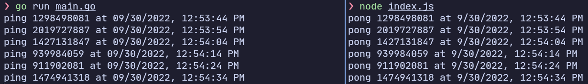

# protobuf-example
1. A Golang program that sends an HTTP request with a serialized protobuf containing the timestamp and a random number.
2. A NodeJS server that recieves the request and deserializes the protobuf.

